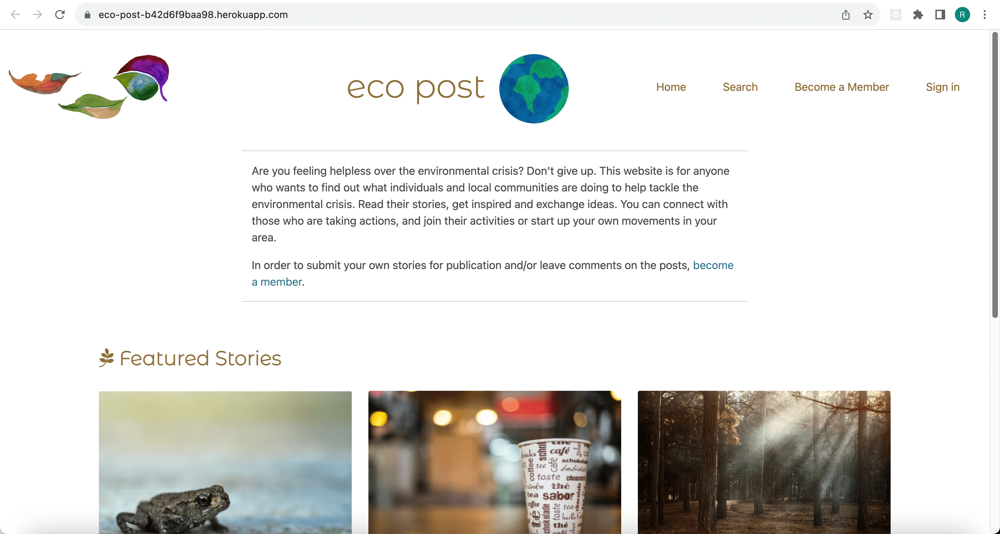

# eco post

The deployed app: https://eco-post-a732dab85eab.herokuapp.com/

## Contents

* [Project Goals](#project-goals)
* [User Stories](#user-stories)
* [Features in a Nutshell](#features-in-a-nutshell)
* [Wireframes](#wireframes)
* [Notes on the Design](#notes-on-the-design)
* [Each Part and Function in Detail](#each-part-and-function-in-detail)
* [Deployment Process](#deployment-process)
* [Automated Testing](#automated-testing)
* [Manual Testing](#manual-testing)
* [Bugs](#bugs)
* [Aspects to be improved in the future](#aspects-to-be-improved-in-the-future)
* [Validating python, CSS, Html code with Tools](#validating-python-css-html-code-with-tools)
* [Checking Performance and Accessibility](#checking-performance-and-accessibility)
* [Media](#media)
* [Credits](#credits)
- - -

## Project Goals
eco post offers a platform where users can share their ideas on what individuals could do to protect the environment. Many people feel helpless, thinking that individuals cannot do so much in face of the environmental crisis. Here, visitors can read posts written by others, leave comments and write their own posts. Users can connect with others who are concerned about the crisis, get motivated to take actions, or at least find some hope.  The app can target users in a particular region or a country.

## User Stories

No.|As a… |I can…|so that …|Priority (1 is the highest)|
|:--|:-----|:--------------------------------|:----------------------------------------|:--|
|1|site visitor | understand what the site is for and how to use it| I can immediately start using the site.| 1|
|2|site visitor | use this site on screen of different sizes | I can use the app on any devices.| 1|
|3|site visitor | sign up for an account| I can participate in the community by writing posts and comments|1|
|4| user | see featured posts on the home page |I don't necessarily have to look for what to read but can immediately read interesting posts.| 1|
|5| user | see the detailed page of a post |I can read the full content of the post as well as comments written on the post.| 1|
|6| user |see a list of recently published posts | I can browse through the newest posts.| 1|
|7| user | see a list of most ‘liked’ posts |I can browse through popular posts.| 1|
|8| member | write posts |I can share my stories with other users.| 1|
|9| member | edit my drafts |I can update or correct the content.| 1|
|10| member | delete my posts |writings that I no longer need will be removed from the database.| 1|
|11| member |write comments on posts |I can participate in discussions with other members.| 1|
|12| member | edit my comments |update or correct the content.| 1|
|13| member | delete my comments |take back my comments if I change my mind later.| 1|
|14| user | search posts by title, author, keywords, published dates and other factors | I can find the kind of posts I am looking for.| 1|
|15| member |‘like’ posts | I can show my appreciation for particular posts.| 1|
|16| member| see a page displaying 1. the posts and drafts I've written, 2. the posts I've commented on and 3. the posts I've bookmarked | I can easily access them.| 1|
|17| admin|present posts that are particularly interesting on the home page | visitors are likely to read them first and get a good impression of the site. |1|
|18| admin | make sure that users can update or delete their posts only before they submit their drafts | published posts will not be suddenly changed or get deleted.| 1|
|19| admin| make sure that users can update or delete only the posts and comments written by themselves | the users can be assured that no one else will make changes to their writings.| 1|
|20|admin | make sure that users can access only their own ‘My Page’ | users cannot access pages that are irrelevant to them.| 1|
|21|user|see feedback messages | I can be sure the requests I made have been processed. |1|
|22|user |see a confirmation dialog before deleting my drafts and comments | I will not delete them by mistake.| 1|
|23| user |bookmark posts | I can easily access certain posts later.| 2|

## Features in a Nutshell:
Users can see lists of excerpts from
-	featured stories
-	posts published in the previous 7 days
-	most liked stories of all time
-	posts written by them
-	posts commented by them
-	posts bookmarked by them

Users can read the entire content of published posts 
Users can search stories by title, authors and other factors 
Users can sign up to become members 
Members can like and bookmark posts 
Members can leave comments on the posts 
Members can write their own stories and publish them 
Members can edit and delete comments 
Members can update or delete their posts before publishing them 

## Wireframes
Wireframes for the app can be found [here.](https://wireframe.cc/pro/pp/873798723651976)
Please click on "Homepage" in the upper left corner to see wireframes of different pages of the app.

## Notes on the Design 
The overall appearance is kept simple and clean so as not to interfere with various colors that the featured images will bring in.

**About the Colors**
- I used beige (rgb(141, 111, 56)) for the navigation links, headings and buttons.
- I used blue (color: rgb(46, 122, 145)) for links in the text.
- I used light grey (#e8e8e8) for the footer.
- Beige and blue were chosen because they are associated with nature.

**About the Fonts**
- Montserrat Alternates was used for headings because it's stylish and visually pleasant when used sparingly.
- For the content Lato is used since it's readable and familiar.

**Logo, Favicon and other graphics**
- I used a clover for the logo and favicon because it’s a widely liked symbol and is associated with good luck and hope, giving a friendly and positive impression. 
- I used a graphic of blue and green earth next to the heading, because this graphic is beautiful and improves the appearance of the page

## Each Part and Function in Detail

### Navigation (common to all pages)

- The logo of the website is located on the left side of the navigation bar. 
- On the right side, links to other pages are provided.
- Logged-in users will find links to ‘Home,’ ‘Search,’ ‘Write Stories,’ ‘My Page’ and ‘Sign out.
- Other users will find links to ‘Home,’ ‘Search,’ ‘Become a Member,’ and ‘Sign in.’
- These terms clearly indicate what these linked pages will present.
- Only the content of 'My Page' may not be clear for first-time visitors, but if they navigate to the page, they will see lists of posts that are grouped by labeled categories, so that should become clear. 

### Footer (common to all pages)
- Links to social networks are provided.

### Home Page

**Heading** 

- The heading at the center states the title of this website ‘ecopost.’
- A graphic of earth is placed on the right side. 

**Introduction**
- Below the heading an introductory paragraph explains what the site is for and how to use it.
- The paragraph encourages users to take part in the blog. 
- The first sentence addresses the problem that many people share – that they feel helpless, thinking individuals cannot do much to save the environment, and this is meant to establish immediate connection with the site visitors.
- Then the rest of the paragraph offers a possible solution, inviting users to read the posts and connect with others.    
- The paragraph aims to capture readers’ interests and motivates them to participate in this app in a welcoming and concise manner. 

**Featured Stories Section**
- Among the posts that are submitted in the week, admin of the site will choose three ‘featured stories’ that are most likely to capture readers’ interests and will display those posts in this section.  
- The featured image, title, author, published date and the excerpt of each featured story will be shown, so that users can have general ideas of what the posts are about.
- Each excerpt has a link that says ‘Read the full story,’ which will take users to the detail page that shows the full content of the post.
- Presenting a few featured stories on the home page has advantages: it removes from the visitors the stress of having to choose what to read, and it also increases the chance of users liking the site and wanting to revisit it.  

**Links to More Post Articles**
- At the bottom of the page, links to ‘More stories from this week’ and ‘Readers’ favorite stories of all time’ are provided.
- This invites users to explore more post articles.  

### "More Stories from This Week" and Readers' Favorite Stories of All Time"
- 'More Stories from This Week' will show a list of post articles published in the previous 7 days except the featured stories.
- "Readers' Favorite Stories of All Time" shows a list of post articles that are liked more times than other posts.
- I made this page 'Readers' Favorite Stories of All Time' since interesting posts are worth reading regardless to how old they are.
- The admin can set the number of likes above which posts will be included on this page.  They can do so by setting the variable min_num_likes in line 17 of views.py.
- Each page will show 6 posts, and if there are more than 6 posts, the posts will be paginated.

### Detail Page
- The full content of a given post is presented.
- At the top left, the title, author, city and published dates are stated.
- At the top right the featured image is shown.
- The full text of the blog is presented below the title and the image.
- If the post is in ‘draft’ state, and if the user is the author of the post, update and delete buttons are provided below the post content.
- If the post has been published, comments are displayed on the bottom left.
- The comments are listed in the order of oldest to newest so that users can follow the conversation.
- If users are logged in, they will see a comment form on the right side of the comments so they can leave comments.
- For users who haven’t logged in, a note will say ‘Want to leave comments?  Sign in or Become a member,’ which includes links to log-in and sign-up pages.

**Additional Functions on Detail Page**
- By clicking on the heart icon below the featured image, users can 'like' the post, or undo that action.
- Similarly, by clicking on the book icon next to the heart, users can bookmark the post, or undo the action.
- Bookmarked posts can be found on ‘My Page.’ 
- The like function is an important element of this app since it offers opportunities for interaction among users--readers can express their appreciation for the articles, and the authors will be rewarded. 
- The bookmark function is also a useful function because users can make a list of the posts they want to come back to.

### Write Stories
- Here logged-in members can write their own stories they want to share.
- The fields are: title, content, featured image (optional), cateogry (select box) and city
- if no image is uploaded as featured image, a default image will be set for the post.
- Users can click on 'Save' to save drafts so they can edit them later, or click on ’Publish’ to publish the posts.
- Users are warned that if the post includes any inappropriate content, the post will be removed from the site.

### Update Post
- Authors of the posts can update their own writings.
- They can update the post by writing over prepopulated fields or uploading a new image.
- For unpublished posts, 'Save', ‘Publish’ and 'Cancel' buttons are displayed.
- For published posts, 'Save' and 'Cancel' buttons are displayed.

### Delete Post Function (no page)
- Authors of the posts can delete their own drafts before submitting them by clicking 'Delete' button on "Detail Page.'
- A confirmation dialog will ask if users really want to proceed.
- If 'OK' is clicked, the post will be deleted from the database, and the users are redirected to the home page.

### Update and Delete Comment (Delete comment has no page)
- The writer of the comment can update or delete their comment by clicking on the update icon or the trash bin icon right by their comment on 'Detail Page.'
- If edited, the comment will be labeled with a note 'edited.'
- If deleted, a note will say 'Comment deleted' in place of the comment
- I wanted to label edited and delted comments as such, since the comments are records of interaction among users, and it could cause confusion if comments can be updated or deleted without any notes.  

### Search Stories
- Users can search posts by title, author, keywords, published dates, number of likes, cities and categories.
- They can enter one or more fields and click on ‘Search’ to get the search results.
- The search results will be displayed below the search form.
- If no input was made or only spaces are entered, a note will say, 'Please enter at least one field.'
- If no match was found, a note will say, 'No matching results found'

### Notes on Other Pages
- “Become a Member” (sign up page), “sign in” and “sign out” pages were taken from django.allauth.
- The pages were styled with my own css to match other pages.

### Access Control
**By Desgin**
- Only logged in users will find links to ‘Write Stories’ and ‘My Page’ in the navigation bar so other users can’t get to the pages via links.  
- 'Update' and 'Delete' buttons for posts and comments appear only if the user is the writer of the posts or of the comments.  Others can’t get to update pages or delete posts & comments through buttons.
- 'Update' and 'Delete' buttons for posts will appear only if the posts haven't been published.

**LoginRequiredMixin and UserPassestestMixin**
- In order to prevent users from accessing certain functions by entering URLs, LoginRequiredMixin and/or UserPassestestMixin are used.
- ‘Write Stories’ has LoginRequiredMixin, so users who are not logged in will be sent to a 403 error page.
- ‘Update Post,’ ‘Update Comment’ and ‘Delete Comment’ views are controlled by LoginRequiredMixin and UserPassestestMixin, and these check if the user is the writer of the posts or of the comments.  Other users will be sent to a 403 error page.
- Additionally, since posts should not be updated or deleted once published, the program is written to send a 403 page if users attempt to update or delete published. 
- For DeletePosts view function, a program is wrriten to raise 403 error in case users attempt to delete posts improperly.  I first used Mixins, but it caused an error so instead I wrote this program (discussed further in 'Bugs' section).

- - -
## Deployment Process

1. Create an app on Heroku:
- On the dashboard on Heroku, click “New.”
- Click “Create new app”
- Name the app and select the region. 
- Click “Create app”

2. Create a database on ElephantSQL.com:

3. At the top level in the project, make env.py file and write the following:

`import os` 

`os.environ[“DATABASE_URL”] = “” // write copied URL from Elphant SQL` 
`os.environ[“SECRET_KEY”] = “” // make up a secret key` 
`os.environ[“PORT”] = "8000"` 
`os.environ[“CLOUDINARY_URL”] = “” // copy and paste the cloudinary url` 

4. Save the file, add the file name env.py to .gitignore file so the content won’t be published on Github.

5. In settings.py, add the following:
 
`import os` 
`import dj_database_url` 
`if os.path.isfile(‘env.py’):` 
`    import env`

6. Replace SECRET_KEY as follows:
`SECRET_KEY = os.environ.get(‘SECRET_KEY’)`

7. Add the app’s URL on Heroku as allowed host
`ALLOWED_HOSTS = [‘appname on Heroku’]`

8. Comment out the original DATABASES and add the following:
`DATABASES = {
    ‘default’: dj_database_url.parse(os.environ.get(“DATABASE_URL”))
    }`

9. Make Procfile at the top level and write inside:
`web: gunicorn appname.wsgi`

10. Add the following so the summernote editor will be loaded when deployed.
`X_FRAME_OPTIONS = ‘SAMEORIGIN’`

11. Save, add, commit and push the change.
Then run python3 manage.py migrate to migrate the database structure to the new ElephantSQL database.

12. On Heroku dashboard, select the app, and open the Settings tab.  Add the following config vars:
DATABASE_URL, SECRET_KEY and PORT = 8000

13. Go to “Deploy” tab, in the “Deployment method” section, select “Github.”  Enter the project name in Github and click “connect.”  Scroll down to the bottom of the page and click “Deploy Branch.”

_ _ _
## Automated Testing
Automated tests were written in test_models.py, test_forms.py and test_views.py.
The list of items tested can be found [here](./ecopost/documents/AUTOMATEDTESTS.md).

## Manual Testing
Manual tests are documented [here](./ecopost/documents/MANUALTESTS.md).

- - -
## Bugs

1. For “Update Stories” I was using View class instead of UpdateView class.  When I updated posts, if the post had a featured image originally, and if I updated other fields (but not the image) and saved the change, the image was lost.  **Solution:** I rewrote “Update Stories” using UpdateView class and the issue was resolved.

2. “Search Stories” page didn’t get displayed.  An error page appeared with the message “Reverse for 'post_detail' with arguments '('',)' not found.”  **Solution:** I was forgetting a slash at the end of the url in urls.py, so I changed the url from ‘search_story’ to ‘search_story/,’ and the issue was resolved.

3. For "Delete Posts" Page, I first used LoginRequiredMixin and UserPassestestMixin in order to make sure the user is the author of the post and that the post hasn't been submitted. That resulted in an error, since the post was deleted before the test func was run, and the test func couldn't find the post in the database.  **Solution:** I wrote the program on line 221, 226-227 in views.py to bypass the issue, and now the access control is functioning.

## Aspects to be improved in the future
- Remember me function on “Log in” page needs to be fixed.
- I will make Contact page where users can write and submit messages to admin.
- I also want to simplify the process of updating comments.  Instead of displaying a whole new page of 'Update Comments,' I want to display a small input box on "Detail Page" where the original comment is displayed.

## Validating python, CSS, Html code with Tools

- I validated style.css at jigsaw (https://jigsaw.w3.org/) 
I got one error saying ‘Property rotate doesn’t exist.’  But clearly property ‘rotate’ is a widely used property of CSS, and it is functioning in the app, so I left the rule as it is.
- I validated html at https://validator.w3.org 
- Errors corrected:
1. Error: Stray start tag footer. 
I was putting footer tags outside body tags on base.html.  I corrected it by inserting the footer inside the body tags.
2.  span tags in ul tag in more_stories.html ln 45-55 
I replaced ul tag with div tag.

After the above corrections the html validation showed no errors.

## Checking Performance and Accessibility
Performance scored 99% on Sign in page, but on other pages it scored between 52% and 72%, and this aspect needs to be improved in the future.
‘Opportunity’ section of the analysis report stated the score can be improved if initial server response time is reduced.  I will try to optimize the code to prepare pages faster. 

Accessibility scored 91% on Update Comment page.
On all other pages accessibility scored 100%.

On Update Comment page, the report said that the score was lowered because the comment form doesn’t have a label.  I inserted a label tag with 'for' attribute in the update_comment.html, but I still got the same score and a warning that I need a label.  I will try to find out how to solve the issue.

Screenshots of the reports are available [here](./documents/LIGHTHOUSE.md)

## Media

Logo image: clover
https://www.freepik.com/free-photos-vectors/clover-logo

Favicon: Clover
https://icons8.com/icons/set/favicon-clover

Heading image: blue earth
https://www.freepik.com/free-vector/watercolor-background-earth-day-with-natural-elements_1069886.htm#query=earth%20plants%20free&position=24&from_view=search&track=ais

Default featured image
https://www.pexels.com/photo/forest-345522/

## Credits
Many thanks to my mentor Jubril Akolade and tutors at Code Institute for their guidance and dedicated support. 

For this application, I used the Code Institute's 'Code Star' project as a starting point.

Code snippets that were taken from 'Code Star' are as follows:

- The code to display 3 excerpts of posts in a row 
``
was used in “More Stories,” “Popular Stories” and “My Page.” 

- The code to paginate post lists was used in “More Stories” (after ln 43) and “Popular Stories” (after ln 41).

- The code to display “Comments” and “Leave Comments” sections was used on “Detail Page.”

- The code to display the heart icon and the number of likes was used in “More Stories,” “Popular Stories” and “Detail Page”

- The code to ‘like’ posts was used in line 71-73, 102-104 in “PostDetail” view in views.py.
The same program was also used for ‘bookmark’ function in line 74-76, 105-107 in “PostDetail” view in views.py.

- The code to post comments was used in line 108-117 in PostLikeView in views.py

Other sources for code snippets taken in this project:
- The code to display links to social networks (lines in 68-87 in base.html) was taken from “Love Running” project.

- The code for turning the navbar to a hamburger menu (lines 9-19 in script.js & lines 21-45 in base.html) was taken from [this site.](https://stackoverflow.com/questions/70370519/how-can-i-turn-my-navbar-into-hamburger-menu-for-mobile-using-responsive-design)

- The code to sign in a testuser (line 16-20 in test_views.py) was taken from [this site](https://stackoverflow.com/questions/2619102/djangos-self-client-login-does-not-work-in-unit-tests)

- The code to handle 500 error was taken from [this site](https://pythoncircle.com/post/40/designing-custom-404-and-500-error-pages-in-django/).
